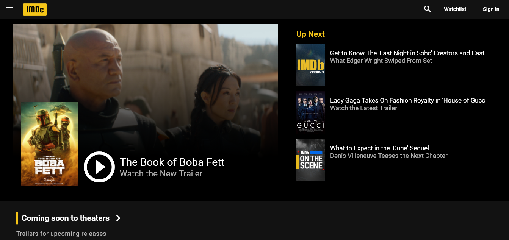
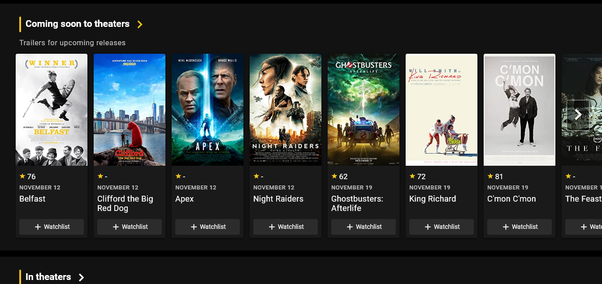

# IMD(c)

Layout based on [IMDb](https://www.imdb.com)'s, with a couple of carousels, navigation drawer and a Watchlist feature, connected to Google Firebase.

Link: https://llfalcao.github.io/imdb-clone

### Languages and Tools

    
    
    
    
    

# Preview

